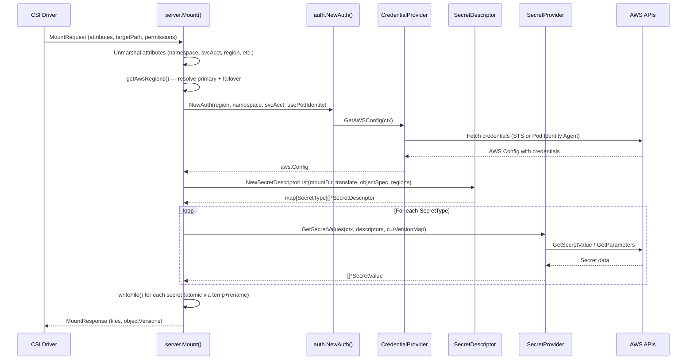

# Architecture

## Overview

The AWS Secrets Store CSI Driver Provider (ASCP) is a gRPC server plugin for the [Secrets Store CSI Driver](https://github.com/kubernetes-sigs/secrets-store-csi-driver). It receives mount requests from the CSI driver, authenticates to AWS using the pod's identity, fetches secrets from AWS Secrets Manager or SSM Parameter Store, and writes them as files into the pod's mounted volume.

## High-Level Architecture

```mermaid
graph TB
    subgraph Kubernetes Cluster
        Pod[Application Pod] -->|volume mount| CSI[Secrets Store CSI Driver]
        CSI -->|gRPC unix socket| ASCP[ASCP Provider]
    end

    subgraph ASCP Provider
        Server[server.Mount] --> Auth[auth.NewAuth]
        Auth -->|IRSA| IRSA[IRSACredentialProvider]
        Auth -->|Pod Identity| PodID[PodIdentityCredentialProvider]
        Server --> Descriptor[SecretDescriptor Parser]
        Descriptor --> Factory[SecretProviderFactory]
        Factory -->|secretsmanager| SM[SecretsManagerProvider]
        Factory -->|ssmparameter| SSM[ParameterStoreProvider]
        Server --> Writer[File Writer]
    end

    IRSA -->|AssumeRoleWithWebIdentity| STS[AWS STS]
    PodID -->|Token Exchange| PIA[Pod Identity Agent]
    SM --> ASM[AWS Secrets Manager]
    SSM --> ASSM[AWS SSM Parameter Store]
    Writer -->|write files| MountPoint[/var/lib/kubelet/pods/.../mount]
```

## Request Flow



## Design Patterns

### Factory Pattern
`SecretProviderFactory` maps `SecretType` → `SecretProvider` implementation. A `ProviderFactoryFactory` function type allows the server to create factories with different AWS configs per region.

### Strategy Pattern
Authentication uses the Strategy pattern: `Auth.GetAWSConfig()` delegates to either `IRSACredentialProvider` or `PodIdentityCredentialProvider` based on the `usePodIdentity` flag, both implementing the `ConfigProvider` interface.

### Multi-Region Failover
Both providers iterate over a list of regional clients. On 5xx errors, the next region is tried. On 4xx errors (client fault), the request fails immediately. This is controlled by `utils.IsFatalError()`.

### Atomic File Writes
Secrets are written to a temp file first, then renamed to the target path. This provides near-atomic updates so pods never read partial files.

### Batch Optimization
- **Secrets Manager**: Optimized for latency — uses `DescribeSecret` to check currency before fetching, avoiding unnecessary `GetSecretValue` calls on remounts.
- **Parameter Store**: Optimized for API rate limits — batches up to 10 parameters per `GetParameters` call.

## Deployment Architecture

```mermaid
graph LR
    subgraph kube-system namespace
        DS[DaemonSet: csi-secrets-store-provider-aws]
        CSI_DS[DaemonSet: secrets-store-csi-driver]
    end

    DS -->|unix socket| CSI_DS
    DS -->|hostPath| ProviderVol[/var/run/secrets-store-csi-providers]
    DS -->|hostPath| MountDir[/var/lib/kubelet/pods]

    subgraph RBAC
        SA[ServiceAccount] --> CR[ClusterRole]
        CR -->|get| Pods
        CR -->|get| Nodes
        CR -->|get| ServiceAccounts
        CR -->|create| SA_Tokens[ServiceAccount Tokens]
    end
```

The provider runs as a DaemonSet alongside the CSI driver. It communicates via a unix socket at `/var/run/secrets-store-csi-providers/aws.sock`. The Helm chart optionally installs the CSI driver as a dependency.
