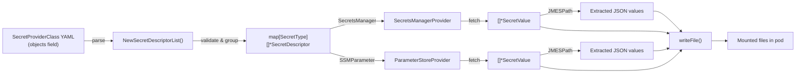

# Data Models

## SecretDescriptor (`provider/secret_descriptor.go`)

The primary data model representing a single secret to be fetched and mounted. Parsed from the `objects` YAML field in a `SecretProviderClass`.

```go
type SecretDescriptor struct {
    ObjectName         string              `json:"objectName"`         // Secret name or full ARN (required)
    ObjectAlias        string              `json:"objectAlias"`        // Override filename for mount
    ObjectVersion      string              `json:"objectVersion"`      // Pin to specific version
    ObjectVersionLabel string              `json:"objectVersionLabel"` // Pin to version label (e.g. AWSCURRENT)
    ObjectType         string              `json:"objectType"`         // "secretsmanager" or "ssmparameter"
    FilePermission     string              `json:"filePermission"`     // 4-digit octal (e.g. "0644")
    JMESPath           []JMESPathEntry     `json:"jmesPath"`           // Extract JSON key-value pairs
    FailoverObject     FailoverObjectEntry `json:"failoverObject"`     // Secondary region secret
    translate          string              // Path translation character (internal)
    mountDir           string              // Mount directory (internal)
}
```

**Key methods**:
| Method | Returns | Purpose |
|--------|---------|---------|
| `GetFileName()` | `string` | Resolved filename (alias or name, with path translation) |
| `GetMountPath()` | `string` | Full path: mountDir + fileName |
| `GetSecretType()` | `SecretType` | Enum: `SecretsManager` or `SSMParameter` |
| `GetSecretName(useFailover)` | `string` | Primary or failover object name |
| `GetObjectVersion(useFailover)` | `string` | Primary or failover version |
| `GetObjectVersionLabel(useFailover)` | `string` | Primary or failover label |
| `GetFilePermission()` | `os.FileMode` | Parsed octal permission (default: 0644) |

---

## JMESPathEntry (`provider/secret_descriptor.go`)

Specifies a JSON key to extract from a secret and mount as a separate file.

```go
type JMESPathEntry struct {
    Path           string `json:"path"`           // JMESPath expression
    ObjectAlias    string `json:"objectAlias"`    // Filename for this extracted value
    FilePermission string `json:"filePermission"` // Optional per-entry permission
}
```

---

## FailoverObjectEntry (`provider/secret_descriptor.go`)

Defines an alternate secret in a failover region.

```go
type FailoverObjectEntry struct {
    ObjectName         string `json:"objectName"`         // Failover secret name/ARN
    ObjectVersion      string `json:"objectVersion"`      // Must match primary version
    ObjectVersionLabel string `json:"objectVersionLabel"` // Failover version label
}
```

**Validation rules**:
- Requires `objectAlias` on the parent descriptor
- Requires `failoverRegion` to be defined in the `SecretProviderClass`
- ARN region must match the failover region
- `objectVersion` must match between primary and failover

---

## SecretType (`provider/secret_descriptor.go`)

Enum distinguishing the two AWS secret services.

```go
type SecretType int

const (
    SSMParameter   SecretType = iota  // 0
    SecretsManager                     // 1
)
```

**Type mapping** (from `objectType` string or ARN service):
| Input | SecretType |
|-------|-----------|
| `"secretsmanager"` | `SecretsManager` |
| `"ssmparameter"` | `SSMParameter` |
| `"ssm"` | `SSMParameter` (alias, not valid as objectType) |

---

## SecretValue (`provider/secret_value.go`)

Holds a fetched secret's raw bytes and its originating descriptor.

```go
type SecretValue struct {
    Value      []byte
    Descriptor SecretDescriptor
}
```

- `String()` returns `<REDACTED>` to prevent accidental logging of secrets
- `getJsonSecrets()` applies JMESPath expressions to extract sub-values

---

## Client Wrapper Types

### SecretsManagerClient (`provider/secrets_manager_provider.go`)

```go
type SecretsManagerClient struct {
    Region     string
    Client     SecretsManagerGetDescriber
    IsFailover bool
}
```

### ParameterStoreClient (`provider/parameter_store_provider.go`)

```go
type ParameterStoreClient struct {
    IsFailover bool
    Region     string
    Client     ParameterStoreGetter
}
```

Both wrap an AWS SDK client with region metadata and a failover flag.

---

## Auth (`auth/auth.go`)

```go
type Auth struct {
    region, nameSpace, svcAcc, podName string
    preferredAddressType, eksAddonVersion string
    usePodIdentity                        bool
    podIdentityHttpTimeout                *time.Duration
    k8sClient                             k8sv1.CoreV1Interface
    stsClient                             stscreds.AssumeRoleWithWebIdentityAPIClient
}
```

---

## CSIDriverProviderServer (`server/server.go`)

```go
type CSIDriverProviderServer struct {
    *grpc.Server
    secretProviderFactory  provider.ProviderFactoryFactory
    k8sClient              k8sv1.CoreV1Interface
    driverWriteSecrets     bool
    podIdentityHttpTimeout *time.Duration
    eksAddonVersion        string
}
```

---

## Data Flow Diagram


