# Dependencies

## Direct Dependencies

| Package | Version | Purpose |
|---------|---------|---------|
| `github.com/aws/aws-sdk-go-v2` | v1.41.1 | Core AWS SDK |
| `github.com/aws/aws-sdk-go-v2/config` | v1.32.7 | AWS config loading |
| `github.com/aws/aws-sdk-go-v2/credentials` | v1.19.7 | Credential providers (STS, endpoint creds) |
| `github.com/aws/aws-sdk-go-v2/service/secretsmanager` | v1.41.1 | Secrets Manager API client |
| `github.com/aws/aws-sdk-go-v2/service/ssm` | v1.67.8 | SSM Parameter Store API client |
| `github.com/aws/aws-sdk-go-v2/service/sts` | v1.41.6 | STS for IRSA AssumeRoleWithWebIdentity |
| `github.com/aws/smithy-go` | v1.24.0 | Error type inspection (APIError, FaultClient) |
| `github.com/jmespath/go-jmespath` | v0.4.0 | JMESPath JSON query evaluation |
| `google.golang.org/grpc` | v1.78.0 | gRPC server for CSI driver communication |
| `k8s.io/api` | v0.35.0 | K8s API types (TokenRequest, etc.) |
| `k8s.io/apimachinery` | v0.35.0 | K8s meta types (GetOptions, etc.) |
| `k8s.io/client-go` | v0.35.0 | K8s API client (CoreV1Interface) |
| `k8s.io/klog/v2` | v2.130.1 | Structured logging |
| `sigs.k8s.io/secrets-store-csi-driver` | v1.5.5 | CSI driver gRPC provider interface (v1alpha1) |
| `sigs.k8s.io/yaml` | v1.6.0 | YAML parsing for SecretProviderClass objects |

## Dependency Usage Map

```mermaid
graph TD
    subgraph AWS SDK
        SDK[aws-sdk-go-v2 core]
        SM[service/secretsmanager]
        SSM[service/ssm]
        STS[service/sts]
        Creds[credentials]
        Smithy[smithy-go]
    end

    subgraph Kubernetes
        ClientGo[client-go]
        API[k8s.io/api]
        Meta[apimachinery]
        Klog[klog/v2]
    end

    subgraph External
        GRPC[google.golang.org/grpc]
        JMES[go-jmespath]
        YAML[sigs.k8s.io/yaml]
        CSIDriver[secrets-store-csi-driver]
    end

    main --> GRPC
    main --> ClientGo
    main --> Klog
    server --> CSIDriver
    server --> SDK
    server --> ClientGo
    auth --> STS
    auth --> Creds
    auth --> ClientGo
    credential_provider --> Creds
    credential_provider --> ClientGo
    credential_provider --> API
    provider_sm[SecretsManagerProvider] --> SM
    provider_ssm[ParameterStoreProvider] --> SSM
    provider_desc[SecretDescriptor] --> YAML
    provider_val[SecretValue] --> JMES
    utils --> Smithy
```



## Helm Chart Dependencies

| Dependency | Version | Condition |
|-----------|---------|-----------|
| `secrets-store-csi-driver` | `^1` | `secrets-store-csi-driver.install` (default: true) |

Source: `https://kubernetes-sigs.github.io/secrets-store-csi-driver/charts`

## Build Dependencies

| Tool | Purpose |
|------|---------|
| Go 1.25 | Compilation |
| Docker + buildx | Multi-arch container builds |
| Helm | Chart packaging and linting |
| `gofmt` | Code formatting |
| `goimports` | Import organization |
| `staticcheck` | Static analysis |
| `bats` | Integration test runner |
| Python 3 | Test file generation |
| GNU Parallel | Parallel integration test execution |
| `eksctl` | EKS cluster management for integration tests |

## Container Image Layers

```
scratch (empty base)
├── /etc/pki/, /etc/ssl/certs/ (from amazonlinux:2 — CA certificates only)
└── /bin/secrets-store-csi-driver-provider-aws (statically linked Go binary)
```

The final image is minimal — no shell, no package manager, just the binary and TLS certificates.
