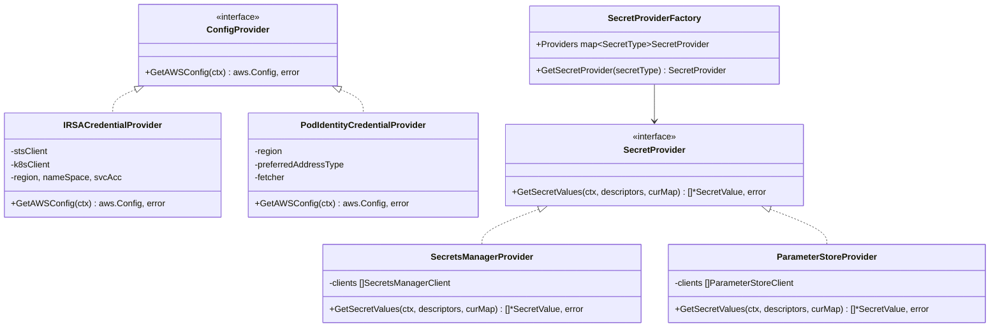

# Interfaces

## Core Interfaces

### ConfigProvider (`credential_provider/credential_provider.go`)

The central authentication interface. Both credential providers implement this.

```go
type ConfigProvider interface {
    GetAWSConfig(ctx context.Context) (aws.Config, error)
}
```

**Implementations**:
- `IRSACredentialProvider` — IRSA via STS AssumeRoleWithWebIdentity
- `PodIdentityCredentialProvider` — EKS Pod Identity via endpoint credentials

---

### SecretProvider (`provider/secret_provider.go`)

The interface for fetching secrets from AWS services.

```go
type SecretProvider interface {
    GetSecretValues(
        ctx context.Context,
        descriptor []*SecretDescriptor,
        curMap map[string]*v1alpha1.ObjectVersion,
    ) (secret []*SecretValue, e error)
}
```

**Implementations**:
- `SecretsManagerProvider` — AWS Secrets Manager
- `ParameterStoreProvider` — AWS SSM Parameter Store

---

### ProviderFactoryFactory (`provider/secret_provider.go`)

Function type that creates a `SecretProviderFactory` for a given set of AWS configs and regions. Enables dependency injection in the server.

```go
type ProviderFactoryFactory func(configs []aws.Config, regions []string) (factory *SecretProviderFactory)
```

**Default implementation**: `NewSecretProviderFactory`

---

## AWS SDK Interfaces (for testability)

### SecretsManagerGetDescriber (`provider/secrets_manager_provider.go`)

```go
type SecretsManagerGetDescriber interface {
    GetSecretValue(ctx context.Context, params *secretsmanager.GetSecretValueInput, optFns ...func(*secretsmanager.Options)) (*secretsmanager.GetSecretValueOutput, error)
    DescribeSecret(ctx context.Context, params *secretsmanager.DescribeSecretInput, optFns ...func(*secretsmanager.Options)) (*secretsmanager.DescribeSecretOutput, error)
}
```

### ParameterStoreGetter (`provider/parameter_store_provider.go`)

```go
type ParameterStoreGetter interface {
    GetParameters(ctx context.Context, params *ssm.GetParametersInput, optFns ...func(*ssm.Options)) (*ssm.GetParametersOutput, error)
}
```

These interfaces wrap the AWS SDK clients, enabling mock injection in unit tests via `NewSecretsManagerProviderWithClients()` and `NewParameterStoreProviderWithClients()`.

---

## gRPC Interface (external)

The provider implements the Secrets Store CSI Driver's gRPC provider interface:

```go
// From sigs.k8s.io/secrets-store-csi-driver/provider/v1alpha1
type CSIDriverProviderServer interface {
    Mount(context.Context, *MountRequest) (*MountResponse, error)
    Version(context.Context, *VersionRequest) (*VersionResponse, error)
}
```

**Socket**: `/var/run/secrets-store-csi-providers/aws.sock`

---

## Kubernetes API Interfaces

The provider uses `k8sv1.CoreV1Interface` from `k8s.io/client-go` for:

| API Call | Purpose |
|----------|---------|
| `ServiceAccounts().Get()` | Look up role ARN annotation (IRSA) |
| `ServiceAccounts().CreateToken()` | Generate JWT tokens for both IRSA and Pod Identity |
| `Pods().Get()` | Find the node a pod is running on (for region lookup) |
| `Nodes().Get()` | Read `topology.kubernetes.io/region` label |

---

## Interface Relationship Diagram


