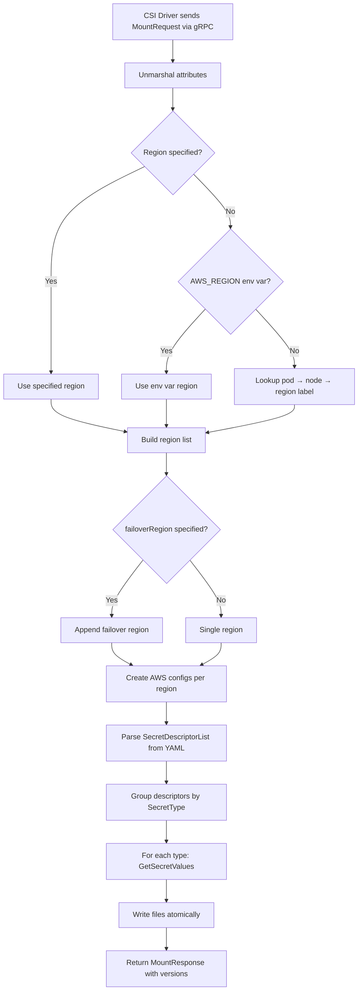
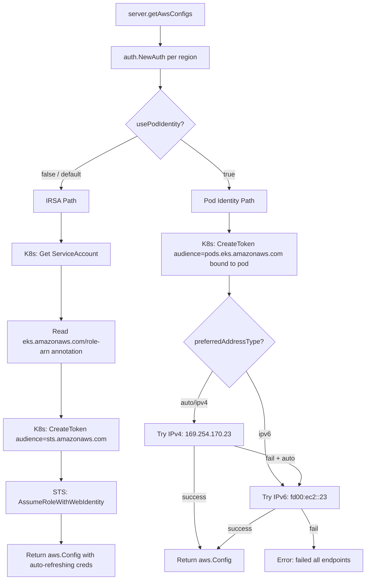
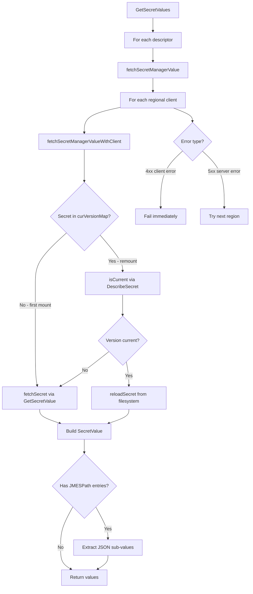
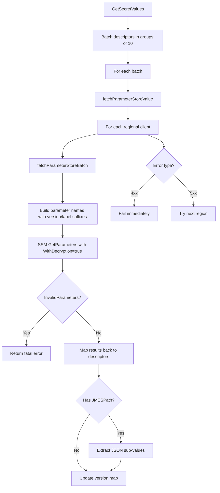
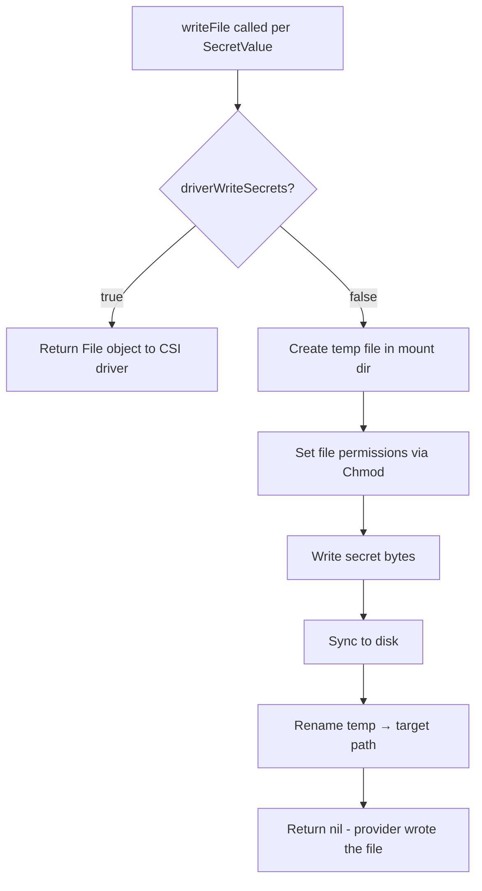
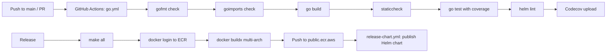
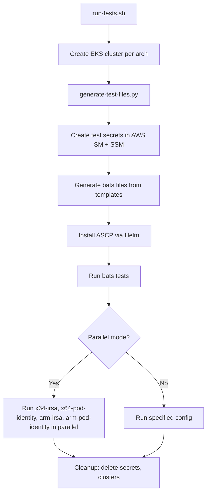

# Workflows

## 1. Mount Request Workflow (Primary)

The main workflow triggered when a pod with a `SecretProviderClass` volume is scheduled.

## 2. Authentication Workflow

## 3. Secrets Manager Fetch Workflow

## 4. Parameter Store Fetch Workflow

## 5. File Write Workflow

## 6. Build & Release Workflow

## 7. Integration Test Workflow

